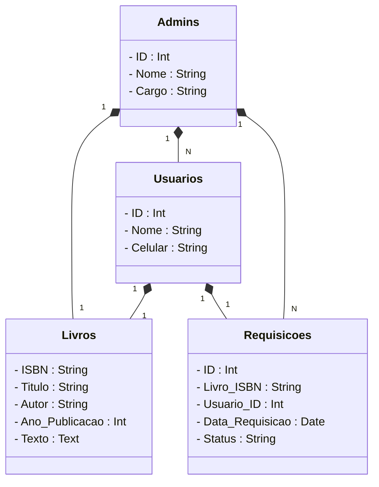

# API-BackEnd-Igreja

## Diagrama de Classe

```mermaid 
classDiagram  
    class Livros {
        - ISBN : String
        - Titulo : String
        - Autor : String
        - Ano_Publicacao : Int
        - Texto : Text
    }
    
    class Usuarios {
        - ID : Int
        - Nome : String
        - Celular : String
    }
    
    class Admins {
        - ID : Int
        - Nome : String
        - Cargo : String
    }
    
    class Requisicoes {
        - ID : Int
        - Livro_ISBN : String
        - Usuario_ID : Int
        - Data_Requisicao : Date
        - Status : String
    }
    
    Admins "1" *-- "1" Livros
    Admins "1" *-- "N" Usuarios
    Admins "1" *-- "N" Requisicoes
    Usuarios "1" *-- "1" Livros
    Usuarios "1" *-- "1" Requisicoes

```
